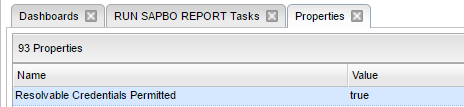
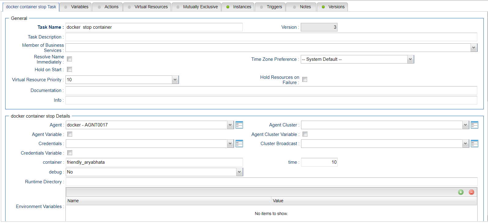

# ut-docker-cli-stop-linux
# Abstract: 

The here described Universal Tasks allows operate your docker container and schedule docker container-based applications as part of any 
existing or new scheduling workflow.   

# 1	Disclaimer

No support and no warranty are provided by Stonebranch GmbH for this document and the related Universal Task. The use of this document 
and the related Universal Task is on your own risk.

Before using this task in a production system, please perform extensive testing.
Stonebranch GmbH assumes no liability for damage caused by the performance of the Universal Tasks

# 2	Scope 
This document provides a documentation how to install and use the Universal Tasks for docker container. If more Task will be created in 
the future this document will be updated accordingly.  

# 3	Introduction
Universal Automation Center seamlessly integrates your legacy system into your container-based DevOps process without the need to re-
design your business process logic, resulting in a shorter time-to-market, improved customer satisfaction, better product quality, more 
reliable releases, improved productivity and efficiency. As a result, you can make use of all the benefits provided by containers like 
portability from applications, **simplified integration, optimized development, increased scalability** and **performance**, while at the same 
time minimizing the risk while introducing a new technology.

Security is an important topic, when working with Containers. Containers are more or less isolated from the host OS system, but they use 
the same kernel. Due to potential security risks a Container should be executed in most cases using a non-privileged user account. In 
some cases, it might however be needed to use some kernel functionalities e.g. when mounting e.g. a USB drive. Universal Automation 
Center allows to centrally maintain individual credentials for each container and provides to start a container using the –privileged 
flag where needed. 

***Central Management of all user and groups** with support for SAML, SSL LDAP/AD for legacy and containerized applications

**Central Management of all Application Credentials and Connections** e.g. SAP and Database connections, script credentials...

**Central Management of all credentials used to connect to a registry**

Our security concept is constantly validated by external BSI certified security companies 

Some details about the universal tasks for docker container:
-	The here described Universal Tasks are calling the native docker cli. Universal Tasks based on the docker python SDK will be described 
in a separate document.   
-	Currently the most important docker cli commands have been implemented. Any missing command can be provided on request or created by 
the user itself based on an existing task. 
-	The current Universal Task require a Linux Agent for running the Universal Tasks scripts
-	The docker private- and public registry are support. Other registries can be added with minimal efforts.
-	Credentials can be provided for each task individually e.g. docker login, user executing the container, you can pass credentials for 
applications running in the container, .. 
-	You can select different log-levels e.g. debug

Note: 
For details on each docker cli command refer to the docker documentation: 

https://docs.docker.com/engine/reference/commandline/docker/

# 4	Installation
# 4.1	Software Requirements

Universal Task name: ut-docker-cli-stop-linux

Related UAC XML Files for template and task: Github repository
Software used: 
For the set-up you need:
1.	Universal Controller 6.4.5.x (any platform: Linux, Windows or SaaS Cloud) 
2.	Universal Agent 6.4.2.2 or higher installed on a Linux Server
3.	Docker engine with version 17.09.1-c or higher installed on a Linux server

# 4.2	Installation Steps
The following describes the installation steps:

**1.	Install the docker engine and a Universal Agent on a Linux Server e.g. Open SUSE**
The following provides a sample set-up for Open SUSE. For other Linux distribution the set-up is similar (check with google). The set-up is provided here to have some guidance on the general step. The steps may vary depending on your landscape.

**# Install Agent on docker engine**
sh ./unvinst --network_provider oms --oms_servers 7878@<oms_ip> --oms_port 7878 --oms_autostart no --ac_netname OPSAUTOCONF --opscli yes 
where:
•	<oms_ip> is the IP or hostname of your oms server.
•	7878 is the default oms port

**# update repro**

zypper update

**# install docker engine package**

zypper in docker

**# Start the Docker daemon.**

systemctl start docker

**# start the docker daemon at boot**

systemctl enable docker

**# Create new docker user** 

The docker package creates a new group named docker. Users, other than root user, must be part of this group to interact with the Docker 
daemon. You can add users with this command syntax:

sudo /usr/sbin/usermod -a -G docker <linux_user>
sudo /usr/sbin/usermod -a -G docker ubroker

**# enable external network access**

OpenSuse: Network Devices -> Network Settings -> Routing menu (f) and check the Enable IPv4 Forwarding box.

**# Test the Docker installation.**

Type in a command shell:
docker run ubuntu /bin/echo 'Hello world'

**2.	Import each docker-cli Universal Task including the Universal Template to your Controller**

Go to “All Tasks” and load via the Import functionality the Universal Task configuration into the Controller. 

Image1

Image2

# 5	Universal Task Configuration
**1.	Activate: Resolvable Credentials in Universal Automation Center:**

Image3

**2.	Fill Out the Universal Task for each docker cli command, which you want to execute:**

In the example below the Task to pull a docker image “ut_docker-cli_pull_linux” is shown.

Image4

Fill out or select the required Credentials e.g. for docker private registry. 
In the example below the docker registry credentials are shown:

Image5

# 6	Universal Tasks for Docker Container

The following chapter describes the provided docker-cli Universal Tasks.

# 6.1	Stop Container
Image6

**Task Screenshot :**

Image7

**Field Description:**

Image8

# 7	Test Cases

The following basic test cases has been performed:

Image9

# 8	Document References
There are no document references.
